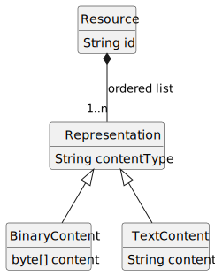
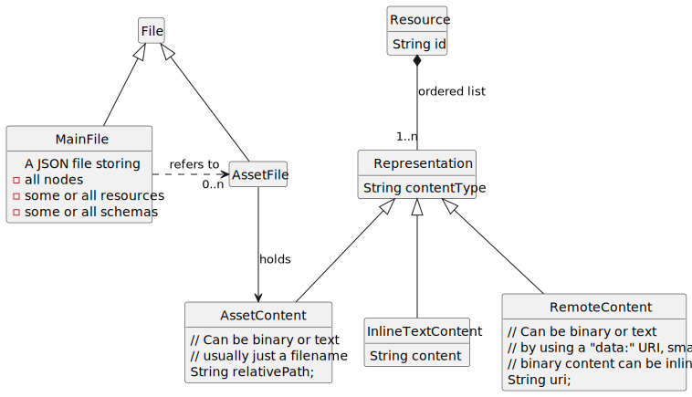

# Design Decision Document
For designing an extensible interchange format for canvas apps, we took
several design decisions. They result in self-imposed requirements.

<!-- TOC -->
* [Design Decision Document](#design-decision-document)
  * [Open Issues](#open-issues)
  * [Sample Applications](#sample-applications)
    * [Excalidraw](#excalidraw)
    * [Zwibbler](#zwibbler)
  * [Design Decisions](#design-decisions)
    * [Nodes vs. Resources](#nodes-vs-resources)
    * [Resources are Web-like](#resources-are-web-like)
    * [Resource Structure](#resource-structure)
    * [Content-Formats](#content-formats)
    * [Schema Usage](#schema-usage)
    * [Assets](#assets)
    * [Relations](#relations)
      * [Node](#node)
      * [Group](#group)
    * [Arrow](#arrow)
    * [Port](#port)
    * [Shortcut Syntax](#shortcut-syntax)
    * [Role of JSON Schema](#role-of-json-schema)
    * [Relations vs Visual Nodes](#relations-vs-visual-nodes)
    * [URL and Name Space](#url-and-name-space)
    * [Schemas as List or Map](#schemas-as-list-or-map)
    * [Coordinate Systems and Relative Positioning (v0.5)](#coordinate-systems-and-relative-positioning-v05)
    * [Resource Display and Fitting (v0.5)](#resource-display-and-fitting-v05)
    * [Extension Consolidation and Schema Versioning (v0.5)](#extension-consolidation-and-schema-versioning-v05)
    * [Vector Type and Multi-dimensional Support (v0.5)](#vector-type-and-multi-dimensional-support-v05)
  * [References](#references)
<!-- TOC -->

The design decisions document tries to capture the consensus reached in the discussions, both the GitHub discussions and the bi-weekly calls.
Some decisions are still not represented in the spec.

## Open Issues
-- currently none --


## Sample Applications
We should be able to recommend ways how to export data from some apps,
which we are aware of.

### Excalidraw

Discussed in [2](https://github.com/orgs/ocwg/discussions/2).

| Property | Sample Value | Function | OCWG Mapping |
|----|----|----|----|
| id | `"XGixwWYl1T09BwczhGvk2"` | *reference* | node id |
| type | `"text"` | *type* | content type of referenced resource |
| x | `702` | *layout* | 2D position: node.pos\[0\] |
| y | `244` | *layout* | 2D position: node.pos\[1\] |
| width | `104.79991149902344` | *layout* | 2D dimensions: node.dim\[0\] |
| height | `25` | *layout* | 2D dimensions: node.dim\[1\] |
| angle | `0` | *layout* | *Extension or built-in?* |
| strokeColor | `"#1e1e1e"` | *draw style* |  |
| backgroundColor | `"transparent"` | *draw style* |  |
| fillStyle | `"solid"` | *draw style* | See [4](https://github.com/orgs/ocwg/discussions/4) |
| strokeWidth | `2` | *draw style* |  |
| strokeStyle | `"solid"` | *draw style* |  |
| roughness | `1` | *draw style* | See [4](https://github.com/orgs/ocwg/discussions/4) |
| opacity | `100` | *draw style* |  |
| groupIds | `[]` | *reference* |  |
| frameId | `null` | *???* |  |
| roundness | `null` | *draw style* |  |
| seed | `1457787307` | *draw style* | See [4](https://github.com/orgs/ocwg/discussions/4) |
| version | `12` | *synchronization* | See [3](https://github.com/orgs/ocwg/discussions/3) |
| versionNonce | `1931653029` | *synchronization* | See [3](https://github.com/orgs/ocwg/discussions/3) |
| isDeleted | `false` | *synchronization* | See [3](https://github.com/orgs/ocwg/discussions/3) |
| boundElements | `null` | *interaction* | See [6](https://github.com/orgs/ocwg/discussions/6), for connector ends. |
| updated | `1711475093047` | *collaboration* |  |
| link | `null` | *reference* |  |
| locked | `false` | *collaboration* |  |
| text | `"Hello World"` | *content* |  |
| fontSize | `20` | *text style* |  |
| fontFamily | `1` | *text style* |  |
| textAlign | `"left"` | *text style* |  |
| verticalAlign | `"top"` | *text style* |  |
| containerId | `null` | *text style* | Defines text wrapping on node boundary, see [5](https://github.com/orgs/ocwg/discussions/5) |
| originalText | `"Hello World"` | *collaboration* |  |
| lineHeight | `1.25` | *text style* |  |


### Zwibbler
See [References](#references) for a sheet on properties and node types.

- [ ] @@TODO add Zwibbler properties here inline


## Design Decisions

### Nodes vs. Resources
We separate the visual elements (nodes) of a canvas from the displayed
content (resources). This allows displaying the same resource in
multiple places, which is great for e.g. block arrow symbols. This in
turn saves space and makes the format more human-friendly (see goals).

SVG also provides
[defs](https://developer.mozilla.org/en-US/docs/Web/SVG/Element/defs)
and use tags.

### Resources are Web-like
We take the way the web uses resources (URI + content negotiation →
representation + content type) as inspiration to model resources.

### Resource Structure
We need to be able to refer to resources using a locally stable ID.
We support textual and binary content, as "Resources are Web-like".
Therefore, we also use a MIME-Type.

Taking the requirements "Resources are Web-like", "Offline" and
"Graceful Degradation" into account, we can use this structure for resources:

**UML Diagram**



    <!--
    @startuml resource-structure

    hide empty members
    hide circles
    interface Resource {
        String id
    }
    interface Representation {
        String mimeType
    }
    interface BinaryContent {
        byte[] content
    }
    interface TextContent {
        String content
    }
    Resource *-- "1..n" Representation : ordered list
    Representation <|-- BinaryContent
    Representation <|-- TextContent
    @enduml
    -->

### Content-Formats
Canvas tools often support some special content formats, e.g.,
free-hand drawings. We might want to define a content for this, so that
it can be exchanged.

Idea: Represent the actual path using the SVG
[PathElement](https://www.w3.org/TR/SVG/paths.html#PathElement) syntax,
i.e. the "d" attribute with a compact syntax such as "M 100 100 L 300
100 L 200 300 z".

Discussed in [4](https://github.com/orgs/ocwg/discussions/4).

### Schema Usage
To be [Offline](requirements.md#offline) capable and [Human Friendly](requirements.md#human), we want
to embed links to all used schemas into the document. Furthermore, we
want to optionally embed the schema content into the document.

### Assets
To be able to load content [Offline](requirements.md#offline), we need to be able to
embed content into the document. For binary content of non-trivial size
(such as small icons), using inline text (e.g. base64-encoded) severerly
impacts [Human Friendly](requirements.md#human). Therefore, we want to be able to store
binary content outside the main file, i.e. as files next to the main
file. **An asset represents an externally stored representation.** To
also allow for [Dynamic](requirements.md#dynamic) content, a representation could also
delegate to a true, live web resource (*RemoteContent*). If that web
resource does not resolve (i.e. client offline or server timeout/error),
then the next fall-back in the list of representations should be
considered.



    <!--
    @startuml diagram-files

    hide empty members
    hide circles
    interface File {
    }
    interface MainFile {
        A JSON file storing
        - all nodes
        - some or all resources
        - some or all schemas
    }
    interface AssetFile {
    }
    File <|-- MainFile
    File <|-- AssetFile


    interface Resource {
        String id
    }
    interface Representation {
        String mimeType
    }

    interface InlineTextContent {
        String content
    }

    interface AssetContent {
        // Can be binary or text
        // usually just a filename
        String relativePath;
    }

    interface RemoteContent {
        // Can be binary or text
        // by using a "data:" URI, small
        // binary content can be inlined
        String uri;
    }

    Resource *-- "1..n" Representation : ordered list
    Representation <|-- AssetContent
    Representation <|-- RemoteContent

    Representation <|-- InlineTextContent
    AssetFile --> AssetContent : holds
    MainFile .> "0..n" AssetFile : refers to

    @enduml
    -->


### Relations
To keep interaction semantics working across tools, we need to
record and exchange them.

Common structures encountered in graphical apps are:

#### Node
A node may be *hidden*. And the user in the app may choose to un-hide the
node.

Discussed in [20](https://github.com/orgs/ocwg/discussions/20).

#### Group
A set of nodes.

- Grouping: From a set of selected items, create a group.
- Move: All members of the group translate the same amount.
- Rotate: The group rotates as if a single node.
- Delete: Deleting the group deletes all members of the group.
- Ungrouping: Removes the group and makes members individual nodes.

Often groups can themselves be part of other groups, recursively.

Structure:
- set of member nodes
- optional: node visualizing the group, i.e., the boundary

> **NOTE**:
> As discussed in [12](https://github.com/orgs/ocwg/discussions/12),
> Obsidian Canvas groups are implemented differently. Rather than using
> references, they use the bounding box of the group to determine which
> cards are contained within it. → An Obsidian Canvas group is a more
> spatial concept, which requires position and dimensions, because they
> determine group contents.

### Arrow
A simple arrow, connecting visually two nodes. Logically this is an
edge.

- Deleting the arrow does not delete the source/target nodes
- Deleting the source/target node *might* delete the arrow. *examples*?

Structure:
- source node
- target node
- optional: node used to depict the arrow visually

Additionally, the arrow might be a *connector* (i.e. endpoint moves when
source/target node is moved) or not. There are round, straight line, or
ortho-line connectors. More complex connectors don’t attach to nodes
directly, but to ports.

Connectors, like the Obsidian Canvas groups, are a form of *computed*
data. In an export, we should record both the resulting computed data as
well as enough data to let other apps re-compute the data.

### Port
A position within a node, acting as a start/end point for a connector.

- Deleting an owner node deletes the port
- An onwer node may have multiple ports
- Ports may be predefined or user-creatable
- A port may or may not be attached to several connectors
- Ports may be auto-layouted according to the owner node, e.g. at the
  corners of a rectangle.

Structure:
- optional: owner node -- *Arrows may also have ports*
- port node

Discussions: [21](https://github.com/orgs/ocwg/discussions/21)


### Shortcut Syntax
To simplify stating often used entities, we might offer shortcut syntax.

**Node Example**
``` js
{
    "id": "some id",
    "content": "Hello"
}
```
implies

``` js
// node
{
    "id": "some id",
    "content": "Hello"
}
// resource
{
    "representations": [
        {
            "id": "resource-1",
            "mimeType": "text/plain",
            "content": "Hello"
        }
    ]
}
```

### Role of JSON Schema
- Schema composition is tricky.
- Cannot define very pretty, compact things like namespace WHILE using
  schema composition.

Resolution: We use JSON Schema where it helps us, but are not constrained by its limitations. Where helpful, we consider to develop custom validation tools, which internally use JSON Schema.


### Relations vs Visual Nodes
- How are they different from nodes? Are they better represented as
  special nodes? E.g. ports, roles, arrows.

Resolution: Ports are attributes of visual nodes. Relations in general are not clearly separable from visual nodes, there is a gray area. We clasify things on a case-by-case basis.


### URL and Name Space
How do we structure the URI space for spec URIs and resolvable URIs?
As discussed on 2024-11-03, we want to use the following structure:

- `https://canvasprotocol.org` -- for the HTML website
- `https://spec.canvasprotocol.org` -- for the technical schema URIs. Could also be the _latest_ version
- `https://spec.canvasprotocol.org/0.2` -- for a specific version of the schema
- `https://community.canvasprotocol.org` -- for community-managed schemas; anybody can also host their own

Considerations

- We use `https` instead of `http` to ensure secure connections.
- We drop the `www` subdomain to keep the URIs short and clean.
- We use `canvasprotocol.org` as the domain to make it clear that this is the official website for the Canvas Protocol.
- A path part `ocif` can be dropped, as `canvasprotocol.org` is specific enough.
- Version info should be present

Proposal:
- We have relation types `/rel` such as `/rel/group` and our built-in base `/node` type.
- Extensions are sub-paths of the base type
  - such as `/node/ports` and `/node/circle`.
  - and for relations `/rel/group/polygon` (adds a polygon boundary) and `/rel/group/background` (group background image).

So the full type names would be `@ocwg/node/ports`, `@ocwg/node/circle`, `@ocwg/rel/group/polygon`, `@ocwg/rel/group/background`.


### List or Map

A list (`array`) looks like this
```json
{
  "schemas": [
    {
      "uri": "https://spec.canvasprotocol.com/node/ports/0.2",
      "name": "@ocwg/ports"
    },
    {
      "uri": "https://example.com/ns/ocif/node/circle/1.0",
      "name": "@example/circle"
    }
  ]
}
```
A map (`object`) has this structure
```json
{
  "schemas": {
    "@ocwg/node/ports": { "uri": "https://spec.canvasprotocol.com/node/ports" },
    "@example/circle": { "uri": "https://example.com/ns/ocif-node/circle/1.0"}
  }
}
```

* Use a map:
    * Schema names must be unique per OCIF document, a map seems to be a clearer and more compact choice.

* Use a list:
    * However, real-world tools will use a JSON parser and on top a domain-specific parser.
Consider the case where  two OCIF files are merged manually or otherwise edited.
Now IDs might be non-unique.
A plain JSON parser will throw a generic error along the lines of "JSON object malformed".
If an array was used, the JSON parser would be fine and the domain specific-parser would say "duplicate ID detected, using first occurrence."
This is a more helpful error message and allows opening the OCIF file, although maybe with slightly unintended results.

**Decision**: We use lists.


## Type Keyword
Each extension is represented in JSON as an object of the form

```json
{
  "type": "@somename/sometype",
  "myProperty": "value",
  "anotherProperty": "value"
}
```

So the `type` property is the single reserved property name in the spec. Should we use a less frequently name? Such as `exttype`?

**Decision**: We keep `type`, as it is so short and clearly expresses the intent.

## Coordinate Systems and Relative Positioning (v0.5)
We separate global coordinates (core spec) from relative positioning (extensions). Apps have different capabilities - some support only global coordinates while others need relative positioning.

We keep global node properties (position, size, rotation) in core spec and create dedicated extensions:
- `@ocif/node/anchored` for percentage-based positioning relative to parent bounds  
- `@ocif/node/transforms` for relative transforms (position offset, rotation, scale)
- Remove global `node.scale` property from core spec

Discussed in [GitHub #52](https://github.com/orgs/ocwg/discussions/52) and Meeting 025.

## Resource Display and Fitting (v0.5)
We add `node.resource-fit` property with CSS-like object-fit semantics to control how resources (images, content) are displayed within node boundaries. This provides a standardized way to handle resource scaling and positioning across different applications.

## Extension Consolidation and Schema Versioning (v0.5)
We merge similar extensions and require explicit versioning to reduce spec complexity and eliminate redundancy:
- Merge `@ocif/rel/set` functionality into `@ocif/rel/group` with added `cascadeDelete` property
- Deprecate `@ocif/node/relative` in favor of `@ocif/node/transforms` extension  
- Make `type` property required for all core extensions
- Use explicit version numbers for extensions (e.g., `@ocif/node/ports/v0.5`)

## Vector Type and Multi-dimensional Support (v0.5)
We introduce Vector OCIF type supporting 2D `[x,y]` and 3D `[x,y,z]` arrays with scalar shortcuts where single numbers auto-expand (e.g., `3` becomes `[3,3,3]`). 2D vectors auto-extend to 3D with `z=0` when needed. This provides future-proofing for 3D applications while maintaining simplicity for 2D cases.


# References

- Data Collection [Properties/Node types used by
  Zwibbler](https://docs.google.com/spreadsheets/d/1yDk6iJVLGseGexhu4qPfOk3vSARgNgYh5zDIfAOCh8c/edit?gid=0#gid=0)

- Spec [JSON Schema
  2020-12](https://json-schema.org/draft/2020-12/json-schema-core)

- Spec [JSON Linked Data](https://www.w3.org/TR/json-ld/)
