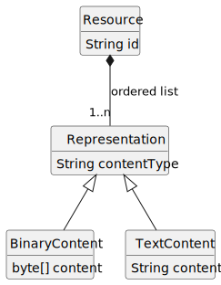
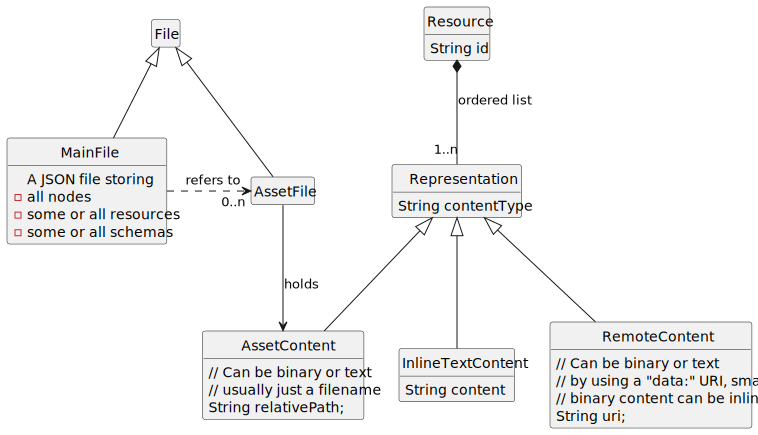

For designing an extensible interchange format for canvas apps, we took
several design decisions. These are self-imposed requirements.

# Open Issues

## Role of JSON Schema

- Schema composition is tricky.

- Cannot define very pretty, compact things like namespace WHILE using
  schema composition.

## Structures

- How are they different from nodes? Are they better represented as
  special nodes? E.g. ports, roles, arrows.

# Requirements

## Offline

The format should allow to be opened in an offline scenario, i.e. all
content needs to be present locally.

## Dynamic

We don’t want to force a canvas to contain only offline content. Some
resource are (a) dynamic (e.g. a weather forecast), or (b) large (e.g.
videos) so that downloading is not always the best strategy.

## Graceful Degration

We want fall-backs for difficult content types. In email, HTML mails
usually have a plain-text fall-back.

## Extensible

We want a number of apps, including those not known at time of writing
this spec, be able to use the export format to round-trip data. Thus,

- an app may write abirtrary data into the export (given it adheres to
  some rule)

- an app may not alter or delete data written be another app (unless the
  whole node is deleted)

## Human Friendly

We want to make it easy for humans to inspect and understand an export
files' content. And, if possible, make changes on the source file.

## Re-use

When possible, we want to re-use existing standards and machanisms, in
order to not reinvent the wheel.

## Precise

We want the spec to cleary define which OCWG files are valid, which are
not, and especially, how to interpret the valid ones.

For numeric precision, which becomes relevant in an "infinite" zoomable
canvas, see [13](https://github.com/orgs/ocwg/discussions/13).

Text rendering and container dimensions have a complex interplay. See
[5](https://github.com/orgs/ocwg/discussions/5).

## Visual Fidelity

Although we don’t strive for 100% visual fideliy (see
[11](https://github.com/orgs/ocwg/discussions/11)), there are some areas
we need to look at:

- text rendering (e.g. different browsers have different default line
  heigths; installed fonts differ, hypenation differs, text direction,
  Unicode, …​)

- transparency & z-Index: What is in effect visible and whats hidden?

- color spaces?

- path stroking (rendering a path is not 100% defined)

# Sample Applications

We should be able to recommend ways how to export data from some apps,
which we are aware of.

## Excalidraw

Discussed in [2](https://github.com/orgs/ocwg/discussions/2).

| Property | Sample Value | Function | OCWG Mapping |
|----|----|----|----|
| id | `"XGixwWYl1T09BwczhGvk2"` | *reference* | node id |
| type | `"text"` | *type* | content type of referenced resource |
| x | `702` | *layout* | 2D position: node.pos\[0\] |
| y | `244` | *layout* | 2D position: node.pos\[1\] |
| width | `104.79991149902344` | *layout* | 2D dimensions: node.dim\[0\] |
| height | `25` | *layout* | 2D dimensions: node.dim\[1\] |
| angle | `0` | *layout* | *Extension or built-in?* |
| strokeColor | `"#1e1e1e"` | *draw style* |  |
| backgroundColor | `"transparent"` | *draw style* |  |
| fillStyle | `"solid"` | *draw style* | See [4](https://github.com/orgs/ocwg/discussions/4) |
| strokeWidth | `2` | *draw style* |  |
| strokeStyle | `"solid"` | *draw style* |  |
| roughness | `1` | *draw style* | See [4](https://github.com/orgs/ocwg/discussions/4) |
| opacity | `100` | *draw style* |  |
| groupIds | `[]` | *reference* |  |
| frameId | `null` | *???* |  |
| roundness | `null` | *draw style* |  |
| seed | `1457787307` | *draw style* | See [4](https://github.com/orgs/ocwg/discussions/4) |
| version | `12` | *synchronization* | See [3](https://github.com/orgs/ocwg/discussions/3) |
| versionNonce | `1931653029` | *synchronization* | See [3](https://github.com/orgs/ocwg/discussions/3) |
| isDeleted | `false` | *synchronization* | See [3](https://github.com/orgs/ocwg/discussions/3) |
| boundElements | `null` | *interaction* | See [6](https://github.com/orgs/ocwg/discussions/6), for connector ends. |
| updated | `1711475093047` | *collaboration* |  |
| link | `null` | *reference* |  |
| locked | `false` | *collaboration* |  |
| text | `"Hello World"` | *content* |  |
| fontSize | `20` | *text style* |  |
| fontFamily | `1` | *text style* |  |
| textAlign | `"left"` | *text style* |  |
| verticalAlign | `"top"` | *text style* |  |
| containerId | `null` | *text style* | Defines text wrapping on node boundary, see [5](https://github.com/orgs/ocwg/discussions/5) |
| originalText | `"Hello World"` | *collaboration* |  |
| lineHeight | `1.25` | *text style* |  |

## Zwibbler

See [References](#_references) for a sheet on properties and node types.

# Design Decisions

## Nodes vs. Resources

We separate the visual elements (nodes) of a canvas from the displayed
content (resources). This allows displaying the same resource in
multiple places, which is great for e.g. block arrow symbols. This in
turn saves space and makes the format more [Human Friendly](#human).

SVG also provides
[defs](https://developer.mozilla.org/en-US/docs/Web/SVG/Element/defs)
and use tags.

## Resources are Web-like

We take the way the web uses resources (URI + content negotiation →
representation + content type) as inspiration to model resources.

## Resource Structure

We need to be able to refer to resources using a locally stable ID.
Taking [Resources are Web-like](#resource), [Offline](#offline) and
[Graceful Degration](#resource-fallback) into account, we get this
minimal structure for resources:



    <!--
    @startuml resource-structure

    hide empty members
    hide circles
    interface Resource {
        String id
    }
    interface Representation {
        String contentType
    }
    interface BinaryContent {
        byte[] content
    }
    interface TextContent {
        String content
    }
    Resource *-- "1..n" Representation : ordered list
    Representation <|-- BinaryContent
    Representation <|-- TextContent
    @enduml
    -->

## Content-Formats

Canvas tools often support some special content formats, especially
free-hand drawing. We might want to define a content for this, so that
it can be exchanged.

Idea: Represent the actual path useing the SVG
[PathElement](https://www.w3.org/TR/SVG/paths.html#PathElement) syntax,
i.e. the "d" attribute with a compact syntax such as "M 100 100 L 300
100 L 200 300 z".

Discussed in [4](https://github.com/orgs/ocwg/discussions/4).

# Schema Usage

To be [Offline](#offline) capable and [Human Friendly](#human), we want
to embed links to all used schemas into the document. Furthermore, we
want to optionally embed the schema content into the document.

# Assets

To be able to load content [Offline](#offline), we need to be able to
embed content into the document. For binary content of non-trivial size
(such as small icons), using inline text (e.g. base64-encoded) severerly
impacts [Human Friendly](#human). Therefore, we want to be able to store
binary content outside the main file, i.e. as files next to the main
file. **An asset represents an externally stored representation.** To
also allow for [Dynamic](#dynamic) content, a representation could also
delegate to a true, live web resource (*RemoteContent*). If that web
resource does not resolve (i.e. client offline or server timeout/error),
then the next fall-back in the list of representations should be
considered.



    <!--
    @startuml diagram-files

    hide empty members
    hide circles
    interface File {
    }
    interface MainFile {
        A JSON file storing
        - all nodes
        - some or all resources
        - some or all schemas
    }
    interface AssetFile {
    }
    File <|-- MainFile
    File <|-- AssetFile


    interface Resource {
        String id
    }
    interface Representation {
        String contentType
    }

    interface InlineTextContent {
        String content
    }

    interface AssetContent {
        // Can be binary or text
        // usually just a filename
        String relativePath;
    }

    interface RemoteContent {
        // Can be binary or text
        // by using a "data:" URI, small
        // binary content can be inlined
        String uri;
    }

    Resource *-- "1..n" Representation : ordered list
    Representation <|-- AssetContent
    Representation <|-- RemoteContent

    Representation <|-- InlineTextContent
    AssetFile --> AssetContent : holds
    MainFile .> "0..n" AssetFile : refers to
    
    @enduml
    -->


# Structures

In order to keep interaction semantics working across tools, we need to
record and exchange them.

Common structures encountered in graphical apps are:

## Node

A node may be *hidden*. And the user in the app may chose to un-hide the
node.

Discussed in [20](https://github.com/orgs/ocwg/discussions/20).

## Group

A set of nodes.

- Grouping: From a set of selected items, create a group.

- Move: All members of the group translate the same amount.

- Rotate: The group rotates as if a single node.

- Delete: Deleting the group deletes all members of the group.

- Ungrouping: Removes the group and makes members individual nodes.

Often groups can themselves be part of other groups, recursively.


Structure:

- set of member nodes

- optional: node visualising the group, i.e. the boundary

> [!NOTE]
> As discussed in [12](https://github.com/orgs/ocwg/discussions/12),
> Obsidian Canvas groups are implemented differently. Rather than using
> references, they use the bounding box of the group to determine which
> cards are contained within it. → An Obsidian Canvas group is a more
> spatial concept, which requires position & dimensions, because they
> determine group contents.

## Arrow

A simple arrow, connecting visually two nodes. Logically this is an
edge.

- Deleting the arrow does not delete the source/target nodes

- Deleting the source/target node *might* delete the arrow. *examples*?

Structure:

- source node

- target node

- optional: node used to depict the arrow visually

Additionally, the arrow might be a *connector* (i.e. endpoint moves when
source/target node is moved) or not. There are round, straight line, or
ortho-line connectors. More complex connectors don’t attach to nodes
directly, but to ports.

Connectors, like the Obsidian Canvas groups, are a form of *computed*
data. In an export, we should record both the resulting computed data as
well as enough data to let other apps re-compute the data.

## Port

A position within a node, acting as a start/end point for a connector.

- Deleting an owner node deletes the port

- An onwer node may have multiple ports

- Ports may be predefined or user-creatable

- A port may or may not be attached to several connectors

- Ports may be auto-layouted according to the owner node, e.g. at the
  corners of a rectangle.

Structure:

- optional: owner node -- *Arrows may also have ports*

- port node

Discussions: [21](https://github.com/orgs/ocwg/discussions/21)

# Design Options / Ideas

## Shortcut Syntax

To simplify stating often used entites, we might offer shortcut syntax.

<div class="formalpara-title">

**Node Example**

</div>

``` js
{
    "id": "some id",
    "content": "Hello"
}
```

implies

``` js
// node
{
    "id": "some id",
    "content": "Hello"
}
// resource
{
    "representations": [
        {
            "id": "resource-1",
            "contentType": "text/plain",
            "content": "Hello"
        }
    ]
}
```

# References

- Data Collection [Properties/Node types used by
  Zwibbler](https://docs.google.com/spreadsheets/d/1yDk6iJVLGseGexhu4qPfOk3vSARgNgYh5zDIfAOCh8c/edit?gid=0#gid=0)

- Spec [JSON Schema
  2020-12](https://json-schema.org/draft/2020-12/json-schema-core)

- Spec [JSON Linked Data](https://www.w3.org/TR/json-ld/)
