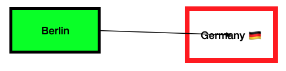

# Open Canvas Interchange Format (OCIF)

**OCWG Candidate Recommendation, 19 February 2024**

**This version:** \
&nbsp;&nbsp;&nbsp;&nbsp;&nbsp;&nbsp; https://spec.canvasprotocol.org/v0.3 \
**Latest version:** \
&nbsp;&nbsp;&nbsp;&nbsp;&nbsp;&nbsp; https://spec.canvasprotocol.org/v0.3 \
**Previous version:** \
&nbsp;&nbsp;&nbsp;&nbsp;&nbsp;&nbsp; https://spec.canvasprotocol.org/v0.2 \
**Feedback:** \
&nbsp;&nbsp;&nbsp;&nbsp;&nbsp;&nbsp; https://github.com/orgs/ocwg/discussions \
**Editor:** \
&nbsp;&nbsp;&nbsp;&nbsp;&nbsp;&nbsp;Dr. Max Völkel ([ITMV](https://maxvoelkel.de)) \
**Authors (alphabetically):** \
&nbsp;&nbsp;&nbsp;&nbsp;&nbsp;&nbsp;[Aaron Franke](https://github.com/aaronfranke/) (Godot Engine), \
&nbsp;&nbsp;&nbsp;&nbsp;&nbsp;&nbsp;[Maikel van de Lisdonk](https://devhelpr.com) ([Code Flow Canvas](https://codeflowcanvas.io/)) \
&nbsp;&nbsp;&nbsp;&nbsp;&nbsp;&nbsp;[Jess Martin](https://jessmart.in) ([sociotechnica](https://sociotechnica.org)) \
&nbsp;&nbsp;&nbsp;&nbsp;&nbsp;&nbsp;Orion Reed

Copyright © 2024, 2025 the Contributors to the Open Canvas Working Group (OCWG).

## Abstract

An interchange file format for canvas-based applications. Visual nodes, structural relations, assets, and schemas.

## Status of this Document

This document is an editor's draft and has no official standing. It is a work in progress and may be updated, replaced, or obsoleted by other documents at any time.

**Legal**:
Open Canvas Interchange Format (OCIF) v0.3 © 2025 by Open Canvas Working Group is licensed under CC BY-SA 4.0. To view a copy of this licence, visit https://creativecommons.org/licenses/by-sa/4.0/

## Document Conventions

- Types:
  This document defines a catalog of _OCIF types_, which are more precise than the generic JSON types.
  See [OCIF Types](#ocif-types) for a catalog.
- The terms _OCIF file_ and _OCIF document_ are used interchangeably.

- Issues are temporary TODOs, which should be resolved before the final version. The `@@` makes them easy to search in an editor.

**Issue Example:**

- [ ] @@ This is an issue

### Table of Contents

<!-- TOC -->

- [Open Canvas Interchange Format (OCIF)](#open-canvas-interchange-format-ocif)
  - [Abstract](#abstract)
  - [Status of this Document](#status-of-this-document)
  - [Document Conventions](#document-conventions)
    - [Table of Contents](#table-of-contents)
- [Introduction](#introduction)
  - [Hello World Example](#hello-world-example)
- [File Structure](#file-structure)
- [Nodes](#nodes)
  - [Text Nodes?](#text-nodes)
  - [Image Nodes?](#image-nodes)
  - [Rectangle](#rectangle)
  - [Oval](#oval)
  - [Arrow](#arrow)
  - [Path](#path)
- [Relations](#relations)
  - [Set Relation](#set-relation)
  - [Group Relation](#group-relation)
  - [Edge Relation](#edge-relation)
- [Assets](#assets)
  - [Resources](#resources)
    - [Representation](#representation)
    - [Fallback](#fallback)
  - [Schemas](#schemas)
    - [Built-in Schema Mappings](#built-in-schema-mappings)
- [Extensions](#extensions)
  - [Defining Extensions](#defining-extensions)
    - [How To Write an Extension Step-by-Step](#how-to-write-an-extension-step-by-step)
  - [Exporting Data with Extensions](#exporting-data-with-extensions)
  - [Handling Extension Data](#handling-extension-data)
- [OCIF Types](#ocif-types)
  - [Angle](#angle)
  - [Color](#color)
  - [ID](#id)
  - [MIME Type](#mime-type)
  - [Node](#node)
  - [Relation](#relation)
  - [Representation](#representation-1)
  - [Resource](#resource)
  - [Schema Entry](#schema-entry)
  - [Schema Name](#schema-name)
  - [URI](#uri)
- [Practical Recommendations](#practical-recommendations-)
- [References](#references)
- [Appendix](#appendix)
  - [Built-in Schema Entries](#built-in-schema-entries)
  - [Known extensions and suggested short names](#known-extensions-and-suggested-short-names)
  - [Examples](#examples)
    - [Node Extension: Circle](#node-extension-circle)
    - [Advanced Examples](#advanced-examples)
  - [OCWG URL Structure (Planned)](#ocwg-url-structure-planned)
  - [Changes](#changes)
    - [From v0.2.1 to v0.3](#from-v021-to-v03)
    - [From v0.2.0 to v0.2.1](#from-v020-to-v021)
    - [From v0.1 to v0.2](#from-v01-to-v02)
  - [Notes to the Editor](#notes-to-the-editor)
  <!-- TOC -->

# Introduction

This document describes the Open Canvas Interchange Format (OCIF), which allows canvas-applications to exchange their data.

**Other Documents** \
For more information about the goals and requirements considered for this spec, see the [Goals](../../design/goals.md), [Requirements](../../design/requirements.md) and [Design Decisions](../../design/design-decisions.md) documents.
**For practical advice on how to use OCIF, see the [OCIF Cookbook](../../cookbook.md).**

**Canvas** \
A canvas in this context is a spatial view, on which visual items are placed.
Often, these items have been placed and sized manually.

There is no formal definition of _(infinite) canvas applications_.
The following references describe the concept:

- https://infinitecanvas.tools/
- https://lucid.co/techblog/2023/08/25/design-for-canvas-based-applications

The goal is to allow different canvas apps to display a canvas exported from other apps, even edit it,
and open again in the first app, without data loss.

In this spec, we define a canvas as consisting of three main parts:

- **[Nodes](#nodes)**: Visual items, placed on the canvas.
- **[Relations](#relations)**: Logical connections between visual items (and other relations).
- **[Resources](#resources)**: Content, such as text, vector drawings, raster images, videos, or audio files.

To make sub-formats explicit, OCIF uses JSON schemas, kept in a fourth part:

- **[Schemas](#schemas)**: Definitions of the structure of nodes and relations.

## Hello World Example

Given two nodes, a rectangle with the word "Berlin" and an oval with "Germany."
We let an arrow point from Berlin to Germany.
The arrow represents a relation of the kind "is capital of."



In OCIF, it looks like this:

```json5
{
  ocif: "https://canvasprotocol.org/ocif/0.3",
  nodes: [
    {
      id: "berlin-node",
      position: [100, 100],
      size: [100, 50],
      resource: "berlin-res",
      /* a green rect with a 3 pixel wide black border line */
      data: [
        {
          type: "@ocwg/node/rect",
          strokeWidth: 3,
          strokeColor: "#000000",
          fillColor: "#00FF00",
        },
      ],
    },
    {
      id: "germany-node",
      position: [300, 100],
      /* slightly bigger than Berlin */
      size: [100, 60],
      resource: "germany-res",
      /* a white rect with a 5 pixel wide red border line */
      data: [
        {
          type: "@ocwg/node/oval",
          strokeWidth: 5,
          strokeColor: "#FF0000",
          fillColor: "#FFFFFF",
        },
      ],
    },
    {
      id: "arrow-1",
      data: [
        {
          type: "@ocwg/node/arrow",
          strokeColor: "#000000",
          /* right side of Berlin */
          start: [200, 125],
          /* center of Germany */
          end: [350, 130],
          startMarker: "none",
          endMarker: "arrowhead",
          /* link to relation which is shown by this arrow */
          relation: "relation-1",
        },
      ],
    },
  ],
  relations: [
    {
      id: "relation-1",
      data: [
        {
          type: "@ocwg/rel/edge",
          start: "berlin-node",
          end: "germany-node",
          /* WikiData 'is capital of'.
           We could also omit this or just put the string 'is capital of' here. */
          rel: "https://www.wikidata.org/wiki/Property:P1376",
          /* link back to the visual node representing this relation */
          node: "arrow-1",
        },
      ],
    },
  ],
  resources: [
    {
      id: "berlin-res",
      representations: [{ "mime-type": "text/plain", content: "Berlin" }],
    },
    {
      id: "germany-res",
      representations: [{ "mime-type": "text/plain", content: "Germany 🇩🇪" }],
    },
  ],
}
```

# File Structure

The OCIF file is a JSON object with the following properties:

| Property    | JSON Type | OCIF Type                       | Required     | Contents                          |
| ----------- | --------- | :------------------------------ | ------------ | --------------------------------- |
| `ocif`      | `string`  | [URI](#uri)                     | **required** | The URI of the OCIF schema        |
| `nodes`     | `array`   | [Node](#node)[]                 | optional     | A list of [nodes](#nodes)         |
| `relations` | `array`   | [Relation](#relation)[]         | optional     | A list of [relations](#relations) |
| `resources` | `array`   | [Resource](#resource)[]         | optional     | A list of [resources](#resources) |
| `schemas`   | `array`   | [Schema Entry](#schema-entry)[] | optional     | Declared [schemas](#schemas)      |

- **OCIF**: The _Open Canvas Interchange Format_ schema URI.
  - The URI SHOULD contain the version number of the schema, either as a version number or as a date (preferred).
  - Known versions:
    - `https://spec.canvasprotocol.org/v0.1` Retrospectively assigned URI for the first draft at https://github.com/ocwg/spec/blob/initial-draft/README.md
    - `https://spec.canvasprotocol.org/v0.2` This is a preliminary version, as described in this draft, for experiments
    - `https://spec.canvasprotocol.org/v0.3` This is the first stable version.
- **nodes**: A list of nodes on the canvas. See [Nodes](#nodes) for details.
- **relations**: A list of relations between nodes (and relations). See [Relations](#relations) for details.
- **resources**: A list of resources used by nodes. See [Resources](#resources) for details.
- **schemas**: A list of schema entries, which are used for relation types and extensions. See [Schemas](#schemas) for details.

JSON schema: [schema.json](schema.json)

**Example** \
A minimal OCIF file, no visible items

```json
{
  "ocif": "https://canvasprotocol.org/ocif/0.3"
}
```

**Example** \
A small OCIF file, with one node and one resource

```json
{
  "ocif": "https://canvasprotocol.org/ocif/0.3",
  "nodes": [
    {
      "id": "n1",
      "position": [100, 100],
      "resource": "r1"
    }
  ],
  "resources": [
    {
      "id": "r1",
      "representations": [
        { "mime-type": "text/plain", "content": "Hello, World!" }
      ]
    }
  ]
}
```

# Nodes

Nodes represent visual items on the canvas.
Conceptually, a node is a rectangle (bounding box) on the canvas, often displaying some content (resource).
A _Node_ is an `object` with the following properties:

| Property   | JSON Type | OCIF Type          | Required     | Contents                            | Default     |
| ---------- | --------- | ------------------ | ------------ | ----------------------------------- | ----------- |
| `id`       | `string`  | [ID](#id)          | **required** | A unique identifier for the node.   | n/a         |
| `position` | `array`   | number[]           | recommended  | Coordinate as (x,y) or (x,y,z).     | [0,0]       |
| `size`     | `array`   | number[]           | recommended  | The size of the node per dimension. | `[100,100]` |
| `resource` | `string`  | [ID](#id)          | optional     | The resource to display             |             |
| `data`     | `array`   | array of Extension | optional     | Extended node data                  |             |
| `rotation` | `number`  | [Angle](#angle)    | optional     | +/- 360 degrees                     | `0`         |
| `scale`    | `array`   | number[]           | optional     | Scale factors to resize nodes       | `[1,1,1]`   |

- **id**: A unique identifier for the node. Must be unique within an OCIF file. See [ID](#ocif-types) type for details.

- **position**: The position of the node on the canvas.

  - Required are **x** (at position `0`) and **y** (at position `1`). Optional is **z** at position `2`.
  - The _coordinate system_ has the x-axis pointing to the right, the y-axis pointing down, and the z-axis pointing away from the screen. This is the same as in CSS, SVG, and most 2D and 3D graphics libraries. The origin is the top-left corner of the canvas.
  - The unit is logical pixels (as used in CSS for `px`).
  - The positioned point (to which the `position` refers) is the top-left corner of the node.
  - The default for z-axis is 0, when importing 2D as 3D.
  - When importing 3D as 2D, the z-axis is ignored (but can be left as-is). When a position is changed, the z-axis CAN be set to 0. Yes, this implies that full round-tripping is not always possible.
  - Values on all three axes can be negative.

- **size**: The size of the node in dimensions. I.e. this is **x-axis** ("width" at position `0`), **y-axis** ("height" at position `1`), and **z-axis** ("depth" at position `2`).

  - Size might be omitted if a linked resource defines the size. E.g., raster images such as PNG an JPEG define their size in pixels. SVG can have a `viewbox` defined, but may also omit it. Text can be wrapped at any width, so a size property is clearly required. In general, a size property is really useful as a fall-back to display at least a kind of rectangle, if the resource cannot be displayed as intended. Size can only be omitted if _all_ resource representations define a size.

- **data**: Additional properties of the node.
  A node may have any number of extensions. Each extension is a JSON object with a `type` property.
  See [extensions](#extensions).

- **resource**: A reference to a resource, which can be an image, video, or audio file. See [resources](#resources).

  - Resource can be empty, in which case a node is acting as a transform for other nodes.

- **rotation**: The 2D rotation of the node in degrees. The rotation center is the positioned point, i.e., top-left. The z-axis is not modified.

- **scale**: Allows to re-scale a given node.
  NOTE: This is particularly useful if the [parent-child](extensions.md#parent-child-relation) relation extension applies to the node and child nodes need a consistent scale transform.

## Text Nodes?

There is no special text node in OCIF. Text is just a resource, which can be displayed by any node.
See [Resources](#resources) for details on text resources.

**Example:** A node showing "Hello, World!" as text.

```json
{
  "nodes": [
    {
      "id": "n1",
      "position": [300, 200],
      "resource": "r1"
    }
  ],
  "resources": [
    {
      "id": "r1",
      "representations": [
        {
          "mime-type": "text/plain",
          "content": "Hello, World!"
        }
      ]
    }
  ]
}
```

TIP: Additional node extensions (e.g. [Rectangle](#rectangle)) can be used to "style" the text node, e.g., by adding a background color or a border.

## Image Nodes?

There is no special image node in OCIF. An image is just a resource, which can be displayed by any node.

**Example:** A node showing an image.

```json
{
  "nodes": [
    {
      "id": "n1",
      "position": [300, 200],
      "resource": "r1"
    }
  ],
  "resources": [
    {
      "id": "r1",
      "representations": [
        {
          "mime-type": "image/png",
          "location": "https://example.com/image.png"
        }
      ]
    }
  ]
}
```

TIP: Additional node extensions can be used. E.g., an [Oval](#oval)) could be used to display the image cropped as a circle.

- [ ] What is the z-ordering of oval/rectangle background vs. image? Relevant for transparency. -> https://github.com/ocwg/spec/issues/10

## Rectangle

- Name: `@ocwg/node/rect`
- URI: `https://spec.canvasprotocol.org/v0.3/core/rect-node.json`

A rectangle is a visual node [extension](#extensions), to define the visual appearance of a node as a rectangle.
A core node has already a position, size, rotation, scale.

| Property      | JSON Type | OCIF Type       | Required | Contents                 | Default   |
| ------------- | --------- | --------------- | -------- | ------------------------ | --------- |
| `strokeWidth` | `number`  | number          | optional | The line width.          | `1`       |
| `strokeColor` | `string`  | [Color](#color) | optional | The color of the stroke. | `#FFFFFF` |
| `fillColor`   | `string`  | [Color](#color) | optional | The color of the fill.   | (none)    |

- **strokeWidth**:
  The line width in logical pixels. Default is `1`. Inspired from SVG `stroke-width`.
- **strokeColor**:
  The color of the stroke. Default is white (`#FFFFFF`). Inspired from SVG `stroke`.
- **fillColor**:
  The color of the fill. Default is none / fully transparent.

z-order: The stroke (`strokeWidth`, `strokeColor`) SHOULD be rendered "on top" of a resource, while the fill (`fillColor`) SHOULD be rendered "behind" the resource.
So a _fillColor_ can be used for a background-color.

These properties are meant to customize the built-in default stroke of a canvas app.
I.e., if all shapes in a canvas app are red and a node is using the rectangle extension, but defines no color, the node should be red as well. The defaults listed in the table are just examples and can be different in different canvas apps.

JSON schema: [rect-node.json](core/rect-node.json)

## Oval

- Name: `@ocwg/node/oval`
- URI: `https://spec.canvasprotocol.org/v0.3/core/oval-node.json`

An oval is a visual node extension, to define the visual appearance of a node as an oval.
An oval in a square bounding box is a circle.

An oval has the exact same properties as a [Rectangle](#rectangle), just the rendering is different.
The oval shall be rendered as an ellipse, within the bounding box defined by the node's position and size.

JSON schema: [oval-node.json](core/oval-node.json)

## Arrow

- Name: `@ocwg/node/arrow`
- URI: `https://spec.canvasprotocol.org/v0.3/core/arrow-node.json`

An arrow is a visual node that connects two point coordinates.
It should be rendered as a straight line, with optional direction markers at the start and end.

| Property      | JSON Type | OCIF Type       | Required     | Contents                | Default   |
| ------------- | --------- | --------------- | ------------ | ----------------------- | --------- |
| `strokeWidth` | `number`  | number          | optional     | The line width.         | `1`       |
| `strokeColor` | `string`  | [Color](#color) | optional     | The color of the arrow. | `#FFFFFF` |
| `start`       | `array`   | number[]        | **required** | The start point.        | n/a       |
| `end`         | `array`   | number[]        | **required** | The end point.          | n/a       |
| `startMarker` | `string`  | string          | optional     | Marker at the start.    | `none`    |
| `endMarker`   | `string`  | string          | optional     | Marker at the end.      | `none`    |
| `relation`    | `string`  | ID              | optional     |                         | n/a       |

- **strokeWidth**:
  The line width in logical pixels. Default is `1`. Inspired from SVG `stroke-width`.

- **strokeColor**:
  The color of the arrow. Default is white (`#FFFFFF`). Inspired from SVG `stroke`.

- **start**:
  The start point of the arrow. The array contains the x and y coordinates. \
  The z-coordinate, if present, is used only in 3D canvas apps.

- **end**:
  The end point of the arrow. The array contains the x and y coordinates. \
  The z-coordinate, if present, is used only in 3D canvas apps.

- **startMarker**:
  The marker at the start of the arrow.
  Possible values are:

  - `none`: No special marker at the start. A flat line end at the start.
  - `arrowhead`: An arrow head at the start. The arrow head points at the start point.

- **endMarker**:
  The marker at the end of the arrow.
  Possible values are:

  - `none`: No special marker at the end. A flat line end at the end.
  - `arrowhead`: An arrow head at the end. The arrow head points at the end point.

- **relation**:
  The ID of the relation defining the semantics of the arrow. If the ID points to an [edge relation](#edge-relation), which is the most likely usage, then the edge relation should point back to the arrow using its `node` property.
  - Deletion semantics: If an arrow is deleted, which has a `relation` stated, that underlying relation should also be deleted.

The markers allow to represent four kinds of arrow:

| startMarker | endMarker | Visual              |
| ----------- | --------- | ------------------- |
| none        | none      | start `-------` end |
| none        | arrowhead | start `------>` end |
| arrowhead   | none      | start `<------` end |
| arrowhead   | arrowhead | start `<----->` end |

NOTE: Canvas apps can use any visual shape for the markers, as long as the direction is clear.

JSON schema: [arrow-node.json](core/arrow-node.json)

## Path

- Name: `@ocwg/node/path`
- URI: `https://spec.canvasprotocol.org/v0.3/core/path-node.json`

A path is a visual node extension, to define the visual appearance of a node as a path.
The rendering of resources inside a path is not defined by OCIF, but by the canvas app.

| Property      | JSON Type | OCIF Type | Required     | Contents               | Default   |
| ------------- | --------- | --------- | ------------ | ---------------------- | --------- |
| `strokeWidth` | `number`  | number    | optional     | The line width.        | `1`       |
| `strokeColor` | `string`  | string    | optional     | The color of the path. | `#FFFFFF` |
| `fillColor`   | `string`  | string    | optional     | The color of the fill. | `none`    |
| `path`        | `string`  | string    | **required** | The path data.         | n/a       |

- **strokeWidth**:
  The line width in logical pixels. Default is `1`. Inspired from SVG `stroke-width`.

- **strokeColor**:
  The color of the path. Default is white (`#FFFFFF`). Inspired from SVG `stroke`.

- **fillColor**:
  The color of the fill. Default is none / fully transparent. Applies only to closed or self-intersecting paths.

- **path**:
  The path data, like the SVG path data `d` attribute. The path data is a string, which can contain the following commands:
  - `M x y`: Move to position x, y
  - `L x y`: Line to position x, y
  - `C x1 y1 x2 y2 x y`: Cubic Bezier curve to x, y with control points x1, y1 and x2, y2
  - `Q x1 y1 x y`: Quadratic Bezier curve to x, y with control point x1, y1
  - `A rx ry x-axis-rotation large-arc-flag sweep-flag x y`: Arc to x, y with radii rx, ry, x-axis-rotation, large-arc-flag, sweep-flag
  - `Z`: Close the path
  - The starting point of the path is the top-left corner of the node, i.e. the positioned point.

NOTE: Canvas apps can simplify rendering of curves (cubic/quadratic bezier, arc) to straight lines.

JSON schema: [path-node.json](core/path-node.json)

# Relations

Relations are used to indicate relationships between Nodes on the canvas.
They can also be used to indicate relationships between other relations.
Relations are generally not visible, but rather conceptual.
If a relation should be visualized, it should have a corresponding Node.

Every relation has the following properties:

| Property | JSON Type | OCIF Type                | Required     | Contents                              |
| -------- | --------- | ------------------------ | ------------ | ------------------------------------- |
| `id`     | `string`  | [ID](#id)                | **required** | A unique identifier for the relation. |
| `data`   | `array`   | [Extension](#extensions) | optional     | Additional data for the relation.     |

Similar to nodes, there is a built-in base relation, which can use extensions.
Contrary to nodes, the base extension has no pre-defined properties except the `id` and `data` properties.
Thus, relations are very flexible.

- **id**:
  A unique identifier for the relation.
  Must be unique within an OCIF file.
  See [ID](#ocif-types) type for details.

- **data**:
  Additional data for the relation.
  Each array entry is an _extension object_, which is the same for nodes and relations.
  See [extensions](#extensions).

In the remainder of this section, the current list of relation extension types (also just called _relation types_) is explained.
In addition to the relation types defined here, anybody can define and use their own relation types.
If this is your first read of the spec, skip over the details of the relation types and come back to them later.

## Set Relation

- Name: `@ocwg/rel/set`
- URI: `https://spec.canvasprotocol.org/v0.3/core/set-rel.json`

A set relation is a relation, which groups nodes together.

A set has the following properties in its `data` object:

| Property  | JSON Type | OCIF Type   | Required     | Contents                  |
| --------- | --------- | ----------- | ------------ | ------------------------- |
| `members` | `array`   | [ID](#id)[] | **required** | IDs of members of the set |

- **members**: A list of IDs of nodes or relations that are part of the set.
  Resources cannot be part of a set.

**Example:** A set relation with three members:

```json
{
  "type": "@ocwg/set",
  "members": ["n1", "n2", "n3"]
}
```

**Example:** A node using the set relation would look like this:

```json
{
  "id": "nodeA",
  "data": [
    {
      "type": "@ocwg/set",
      "members": ["n1", "n2", "n3"]
    }
  ]
}
```

JSON schema: [set-rel.json](core/set-rel.json)

## Group Relation

- Name: `@ocwg/rel/group`
- URI: `https://spec.canvasprotocol.org/v0.3/core/group-rel.json`

A group relation is a relation, which groups nodes together.
It implies stronger semantics than a [set relation](#set-relation).

A group is modeled as a relation with a list of its members.

| Property  | JSON Type | OCIF Type   | Required     | Contents                  |
| --------- | --------- | ----------- | ------------ | ------------------------- |
| `members` | `array`   | [ID](#id)[] | **required** | IDs of members of the set |

- **members**: A list of IDs of nodes (or relations, such as other groups) that are part of the group.

**Semantics**

- Groups can contain groups as members. Thus, all semantics apply recursively.
- When a group is deleted, all members are deleted as well.
- When a group is 'ungrouped,' the group itself is deleted, but its members remain.
- When a member is deleted, it is removed from the group.

JSON schema: [group-rel.json](core/group-rel.json)

## Edge Relation

- Name: `@ocwg/rel/edge`
- URI: `https://spec.canvasprotocol.org/v0.3/core/edge-rel.json`

An edge relates two elements (nodes and/or relation, mixing types is allowed).
It supports directed and undirected bi-edges.

It has the following properties:

| Property   | JSON Type | OCIF Type | Required     | Contents                  | Default |
| ---------- | --------- | :-------- | ------------ | ------------------------- | :------ |
| `start`    | `string`  | [ID](#id) | **required** | ID of source element.     |         |
| `end`      | `string`  | [ID](#id) | **required** | ID of target element.     |         |
| `directed` | `boolean` |           | optional     | Is the edge directed?     | `true`  |
| `rel`      | `string`  |           | optional     | Represented relation type |         |
| `node`     | `string`  | [ID](#id) | optional     | ID of a visual node       |         |

- **from**: The ID of the source element.
- **to**: The ID of the target element.
- **directed**: A boolean flag indicating if the edge is directed. If `true`, the edge is directed from the source to the target. If `false`, the edge is undirected. Default is `true`.
- **rel**: The type of relation represented by the edge. This is optional but can be used to indicate the kind of relation between the source and target elements. Do not confuse with the `type` of the OCIF relation. This field allows representing an RDF triple (subject,predicate,object) as (from,rel,to).
- **node**: The ID of a visual node, that represents the relation visually.
  - If an arrow is used to represent an edge, the arrow should point back via its `relation` to this edge relation.
  - Semantics: If an edge is deleted, which points to a `node`, that node should also be deleted.

JSON schema: [edge-rel.json](core/edge-rel.json)

# Assets

OCIF knows two kinds of assets, [resources](#resources) and [schemas](#schemas). Both are managed by similar mechanisms. Assets can be stored in three ways:

- **Inline**: The asset is stored directly in the OCIF file. It is referenced by its id.
- **External**: The asset is stored in a separate file, which is referenced by the OCIF file. A relative URI expresses the reference.
- **Remote**: The asset is stored on a remote server, which is referenced by the OCIF file. A URI is required as a reference.

## Resources

Resources are the hypermedia assets that nodes display.
They are stored separately from Nodes to allow for asset reuse and efficiency.

Resources can be referenced by nodes or relations.
They are stored in the `resources` property of the OCIF file.
Typical resources are, e.g., SVG images, text documents, or media files.

- Each entry in `resources` is an array of _representation_ objects.
- The order of representations is significant. The first representation is the default representation.
  Later representations can be used as fallbacks.

A resource is an `object` with the following properties:

| Property          | JSON Type | OCIF Type                           | Required     | Contents                        |
| ----------------- | --------- | ----------------------------------- | ------------ | ------------------------------- |
| `id`              | `string`  | [ID](#id)                           | **required** | Identifier of the resource      |
| `representations` | `array`   | [Representation](#representation)[] | **required** | Representations of the resource |

- **id**: A unique identifier for the resource. See [ID](#id) type for details.

- **representations**: A list of representations of the resource.

### Representation

Each _Representation_ object has the following properties:

| Property    | JSON Type | OCIF Type               | Required  | Contents                               |
| ----------- | --------- | ----------------------- | --------- | -------------------------------------- |
| `location`  | `string`  | [URI](#uri)             | see below | The storage location for the resource. |
| `mime-type` | `string`  | [MIME Type](#mime-type) | see below | The IANA MIME Type of the resource.    |
| `content`   | `string`  |                         | see below | The content of the resource.           |

Either `content` or `location` MUST be present. If `content` is used, `location` must be left out and vice versa.

- **location**: The storage location for the resource.
  This can be a relative URI for an external resource or an absolute URI for a remote resource.
  - If a `data:` URI is used, the `content` and `mime-type` properties are implicitly defined already. Values in `content` and `mime-type` are ignored.
- **mime-type**: The IANA MIME Type of the resource. See [MIME Type](#mime-type) for details.
- **content**: The content of the resource.
  This is the actual data of the resource as a string.
  Can be base64-encoded.

**Summary** \
Valid resource representations are

|                 | `location`                      | `mime-type`                                                | `content`          |
| :-------------- | ------------------------------- | ---------------------------------------------------------- | ------------------ |
| Inline text     | Ignored, `content` is set       | E..g. `text/plain` or `image/svg+xml`                      | Text/SVG as string |
| Inline binary   | Ignored, `content` is set       | E.g. `image/png`                                           | Base64             |
| Remote          | `https://example.com/sunny.png` | Optional; obtained from HTTP response                      | Ignored            |
| External        | `images/sunny.png`              | Recommended; only guessable from file extension or content | Ignored            |
| Remote data URI | `data:image/png;base64,...`     | Ignored; present in URI                                    | Ignored            |

**Example:** A resource stored inline:

```json
{
  "resources": [
    {
      "id": "r1",
      "representations": [
        { "mime-type": "image/svg+xml", "content": "<svg>...</svg>" }
      ]
    }
  ]
}
```

### Fallback

**Example**: A resource with a fallback representation.

- The first representation is an SVG image, stored inline.
- The second representation is a remotely stored PNG image. If SVG content cannot be rendered by the application, the PNG can be used.
- The third representation is a text representation of the resource. This can be used for accessibility or indexing purposes.

```json
{
  "resources": [
    {
      "id": "r1",
      "representations": [
        { "mime-type": "image/svg+xml", "content": "<svg>...</svg>" },
        {
          "mime-type": "image/png",
          "location": "https://example.com/image.png"
        },
        { "mime-type": "text/plain", "content": "Plan of the maze" }
      ]
    }
  ]
}
```

## Schemas

A schema in this specification refers to a [JSON Schema](https://json-schema.org/draft/2020-12) 2020-12.

Schemas are used to define

- a whole OCIF document,
  - Due to the openness of OCIF, the JSON schema for the OCIF document cannot capture all possible extensions.
- the structure of [extensions](#extensions).

Schemas are stored either inline in the `schemas` property of an OCIF document or externally/remote. See [assets](#assets) for storage options.

Each entry in the `schemas` array is an object with the following properties:

| Property   | JSON Type | OCIF Type                   | Required     | Contents                                 |
| ---------- | --------- | :-------------------------- | ------------ | ---------------------------------------- |
| `uri`      | `string`  | absolute [URI](#uri)        | **required** | Identifier (and location) of the schema  |
| `schema`   | `object`  |                             | optional     | JSON schema inline as a JSON object      |
| `location` | `string`  | [URI](#uri)                 | optional     | Override storage location for the schema |
| `name`     | `string`  | [Schema Name](#schema-name) | optional     | Optional shortname for a schema. "@..."  |

- **uri**: The URI of the schema. The URI is usually absolute. Only for local testing or development, relative URIs are allowed.

  - The URI SHOULD contain the version number of the schema, either as a version number or as a date.

- **schema**: The actual JSON schema as a JSON object. This is only required for inline schemas. If `schema` is used, `location` must be left out.

- **location**: The storage location for the schema.

  - For a schema stored inline, this property should be left out.
  - For a _remote_ schema, the `uri` property is used as a location. This field allows overriding the location with another URL. This is particularly useful for testing or development.
  - An _external_ schema uses a relative URI as a location. This is a relative path to the OCIF file.

- **name**: An optional short name for the schema. This defines an alias to the URI. It is useful for human-readable references to the schema. The name MUST start with a `@` character. Names SHOULD use the convention organisation name `/` schema name. Example name: `@ocwg/circle`. Names MUST be unique within an OCIF file.
  - By convention, schema names do not contain a version number. However, if multiple versions of the same schema are used in a file, the version number MUST be appended to the name, to distinguish between them. E.g. `@example/circle/1.0` and `@example/circle/1.1`.

A JSON schema file may contain more than one type definition (under the `$defs` property).
When referencing a schema URI, there are two options:

- `https://example.com/myschema.json` refers to a schema defining only one (main) type. Implicitly, the first type is addressed.
- `https://example.com/myschema.json#typename` is formally understood as a JSON pointer expression (`/$defs/` _typename_ ) , which refers to a specific type definition within the schema.

To summarize, these schema definitions are possible:

| Schema        | `uri`        | `schema`        | `location`                   | `name`   |
| ------------- | ------------ | --------------- | ---------------------------- | -------- |
| Inline Schema | **required** | the JSON schema | --                           | optional |
| External      | **required** | --              | relative path                | optional |
| Remote        | **required** | --              | -- (URI is used)             | optional |
| Remote        | **required** | --              | absolute URI (overrides URI) | optional |

By defining a mapping of URIs to names, the OCIF file becomes more readable and easier to maintain.

**Example** \
A schema array with two schemas:

```json
{
  "schemas": [
    {
      "uri": "https://spec.canvasprotocol.org/node/ports/0.2",
      "name": "@ocwg/node/ports"
    },
    {
      "uri": "https://example.com/ns/ocif-node/circle/1.0",
      "location": "schemas/circle.json",
      "name": "@example/circle"
    }
  ]
}
```

### Built-in Schema Mappings

To simplify the use of OCIF, a set of built-in schema mappings is defined:

1. Any [Schema Name](#schema-name) of the form

- `@ocwg/rel/`_suffix_

maps to a schema [URI](#uri)

- `https://spec.canvasprotocol.org/v0.3/core/` _suffix_ `-rel.json`.

2. A schema URI of the form

- `@ocwg/node/`_suffix_

maps to a schema URI

- `https://spec.canvasprotocol.org/v0.3/core/` _suffix_ `-node.json`.

Here `0.3` is the current version of the OCIF spec. Later OCIF specs will have different versions and thus different URIs.

Built-in Entries, where the syntax `{var}` denotes placeholders:

```json
{
  "schemas": [
    {
      "name": "@ocwg/node/${ext-type}",
      "uri": "https://spec.canvasprotocol.org/v0.3/core/${ext-type}-node.json"
    },
    {
      "name": "@ocwg/rel/${ext-type}",
      "uri": "https://spec.canvasprotocol.org/v0.3/core/${ext-type}-rel.json"
    }
  ]
}
```

These mappings SHOULD be materialized into the OCIF JSON schema.

# Extensions

No two canvas applications are alike:
There are apps for informal whiteboarding, formal diagramming, quick visual sketches, node-and-wire programming, and many other use cases.
Each of these apps has radically different feature sets.
Extensions are an integral part of OCIF.
They allow adding custom data to nodes, relations, and resources.

- An extension is a JSON object (used as a "property bag") with one mandatory property: `type`.
  Thus, `type` is a reserved property key.
  All other property keys can be used by the extension.
- Arbitrary, nested JSON structures are allowed.
- Extensions SHOULD define how the base properties play together with the extension properties and with other (known) extensions.
- Nodes and relations can have multiple extensions within their `data` array.
- Each extension is an object with a `type` property.

| Property | JSON Type | OCIF Type                                  | Required     | Contents          |
| -------- | --------- | :----------------------------------------- | ------------ | ----------------- |
| `type`   | `string`  | [Schema Name](#schema-name) or [URI](#uri) | **required** | Type of extension |

- **type**: The type of the extension. This is a URI or a simple name.
  If a name is used, that name must be present in the [schemas](#schemas) section, where it is mapped to a URI.

For an example of an extension, see the [appendix](#appendix), [Node Extension: Circle](#node-extension-circle).

## Defining Extensions

If you need to store some extra data at a node for your canvas app, and none of the existing extensions fit, you can define your own extension.

An extensions MUST have a URI (as its ID) and a document describing the extension.

It SHOULD have a version number, as part of its URI.
It SHOULD have a proposed name, and SHOULD have a JSON schema.

The proposed structure is to use a directory in a git repository.
The directory path should contain a name and version number.
Within the repo, there SHOULD be two files:

- README.md, which describes the extension.
- schema.json, which contains the JSON schema for the extension.
  - This schema MUST use the same URI as the extension.
  - It SHOULD have a `description` property, describing briefly the purpose of the extension.
  - It MAY have a `title`. If a title is used, it should match the proposed short name, e.g. `@ocwg/node/oval` or `@ocwg/node/ports/0.3`.

As an example, look at the fictive [Circle Extension](#node-extension-circle) in the appendix.

NOTE: Some extensions (e.g., [@ocif/rel/set](#set-relation) and [@ocif/rel/group](#group-relation)) have the exact same structure (both have a set of members) and differ only in semantics. The text describing what the extension does is the only formal difference between them.

### How To Write an Extension Step-by-Step

- Define the properties of the extension. What data is added to a node or relation?
- Define the URI of the extension. Ideally, this is where you publish your JSON schema file.
- Write a text describing the intended semantics.
- Create a JSON schema that defines the structure of the extension data. Large language models are a great help here.

To publish an extensions, a version number should be included.
It is good practice to use a directory structure that reflects the version number of the extension.
Within the directory, the text is usually stored as a markdown file, which links to the JSON schema.
The OCIF extensions document currently describes several OCIF extensions in one document, which is also possible.

**Example for a file structure**

```
/1.0
  /README.md      <-- your documentation
  /schema.json    <-- your JSON schema
```

## Exporting Data with Extensions

When exporting an OCIF file using extensions, the application SHOULD use inline or external schemas for the extensions.
Remote schemas CAN be used to save space in the OCIF file.

## Handling Extension Data

To support interchange between canvases when features don't overlap,
canvas apps need to preserve nodes and relations that they don't support:

- Canvas A supporting Feature X creates a canvas with a Feature X node in it and exports it as OCIF.
- Canvas B, which does not support Feature X, opens the OCIF file, and some edits are made to the canvas.
- Canvas B exports the canvas to an OCIF file. The nodes for Feature X should still be in the OCIF file, unchanged.

Vital parts of the OCIF format are modelled as extensions.
In the following sections, extensions defined within this specification are listed.

# OCIF Types

The _JSON types_ are just: `object`, `array`, `string`, `number`, `boolean`, `null`.
OCIF defines more precise types, e.g., _ID_ is a JSON string with additional semantic (must be unique within a document).
We also use the syntax `ID[]` to refer to a JSON `array`, in which each member is an _ID_.

Here is the catalog of types used throughout the document (in alphabetical order):

## Angle

A `number` that represents an angle in degrees, from -360 to 360.
The angle is measured in degrees, with positive values indicating a clockwise rotation and negative values indicating a counterclockwise rotation.
Numbers outside the range of -360 to 360 are allowed, but they are normalized to the range by adding or subtracting 360 until the value is within the range.

## Color

A `string` that encodes a color. CSS knows many ways to define colors, other formats usually less.
As a minimum, the syntax `#010203` should be understood as marker (`#`), red channel (`01`), green channel (`02`), and blue channel (`03`). Each channel is a value in the range 0 to 255, encoded as hex (`00` to `ff`). Uppercase and lowercase letters are valid to use in hex color definitions, with no difference in interpretation.
A canvas app SHOULD also allow to state four channels, with the fourth channel the _alpha_ channel, which encodes (partial) transparency. Example: `#ed80e930` is "orchid" with ca. 19% transparency.
The color is expressed in the [sRGB](https://developer.mozilla.org/en-US/docs/Glossary/RGB) color space.

## ID

A `string` that represents a unique identifier.
It must be unique among all IDs used in an OCIF document.
The ID space is shared among nodes, relations, and resources.

NOTE: An OCIF file itself can be use as a resource representation. Thus, a node can show a (then nested) other OCIF file. The ID uniqueness applies only within each OCIF file, not across document boundaries.

## MIME Type

A `string` that represents the _MIME Type_ for a resource.
Typical examples in a canvas are `text/plain`, `text/html`, `image/svg+xml`, `image/png`, `image/jpeg`, `video/mp4`.
IANA content type registry: https://www.iana.org/assignments/media-types/media-types.xhtml

## Node

An `object` representing a visual [node](#nodes).

## Relation

An `object` representing a [relation](#relations).

## Representation

An `object` representing a [resource](#resources) representation.

## Resource

An `array` of [resource](#resources).

## Schema Entry

An `object` representing a [schema](#schemas) entry.
Schema entries assign schema _URIs_ to _Schema Names_.

## Schema Name

A `string` that represents the name of a schema.
It must be _defined_ in the [schemas](#schemas) section of an OCIF document as a `name` property.
It can be _used_ as `type` of relation, `type` of relation extension, or `type` of node extension.

## URI

A `string` that represents a Uniform Resource Identifier (URI) as defined in [RFC 3986](https://tools.ietf.org/html/rfc3986).

# Practical Recommendations

- The proposed MIME-type for OCIF files is `application/ocif+json`.
<!-- see https://github.com/ocwg/spec/issues/13 -->

- The recommended file extension for OCIF files is `.ocif.json`.
  This launches JSON-aware applications by default on most systems.
  The extension `.ocif` is also allowed.

- Parsing:

  - If [IDs](#id) collide, the first defined ID should be used.
    This is a simple rule, which allows for deterministic behavior.
    A warning SHOULD be emitted.

- Schema hosting:

  - A schema MUST have a [URI](#uri) as its identifier.
  - A schema SHOULD be hosted at its URI.
    - [purl.org](https://purl.archive.org/) provides a free service for stable, resolvable URIs. This requires URIs to start with `purl.org`.
  - A schema can solely exist in an OCIF file, in the [schemas](#schemas) entry. This is useful for private schemas or for testing.

  - **Recommendation**: As a good practice, "Cool URIs" (see [references](#references)) should provide services for humans and machines. Given a request to `https://example.com/schema`, the server can decide based on the HTTP `Accept`-header:

    - `application/json` -> Send JSON schema via a redirect to, e.g. `https://example.com/schema.json`
    - `text/html` -> Send a human-readable HTML page via a redirect to, e.g. `https://example.com/schema.html`.
    - See [OCWG URL Structure](#ocwg-url-structure-planned) for a proposed URI structure for OCIF resources.

  - Versioning: Note that relation types have a version and extensions to a relation type have another version themselves.

# References

- https://www.canvasprotocol.org/ (OCWG homepage)
- https://jsoncanvas.org/ (the initial spark leading to the creation of the OCWG)
- https://github.com/orgs/ocwg/discussions (the work)
- The [big sheet](https://docs.google.com/spreadsheets/d/1XbD_WEhO2c-T21EkA6U546tpGf786itpwXdR3dmdZIA/edit?gid=199619473#gid=199619473) an analysis of features of existing canvas apps
- https://github.com/ocwg/spec/blob/initial-draft/README.md (initial spec draft)

- [Cool URIs for the Semantic Web](https://www.w3.org/TR/cooluris/) by Leo Sauermann and Richard Cyganiak, 2008. This document provides general advice on how to create URIs for the Semantic Web.
- [Cool URIs for FAIR Knowledge Graphs](https://arxiv.org/abs/2407.09237), Andreas Thalhammer, 2024. This provides up-to-date practical advice, replacing some advice given in the [Cool URIs](https://www.w3.org/TR/cooluris/) document.

# Appendix

## Built-in Schema Entries

The materialized list of schema entries, as explained in [built-in schema mappings](#built-in-schema-mappings).
Note that core extensions have no version number of their own (in the short name).
They are versioned together with the OCIF spec.
The following block can be assumed to be present in every OCIF document.
It is valid to additionally copy it in.

```json
{
  "@ocwg/node/arrow": {
    "uri": "https://spec.canvasprotocol.org/v0.3/core/arrow-node.json"
  },
  "@ocwg/node/oval": {
    "uri": "https://spec.canvasprotocol.org/v0.3/core/oval-node.json"
  },
  "@ocwg/node/path": {
    "uri": "https://spec.canvasprotocol.org/v0.3/core/path-node.json"
  },
  "@ocwg/node/rect": {
    "uri": "https://spec.canvasprotocol.org/v0.3/core/rect-node.json"
  },
  "@ocwg/rel/edge": {
    "uri": "https://spec.canvasprotocol.org/v0.3/core/edge-rel.json"
  },
  "@ocwg/rel/group": {
    "uri": "https://spec.canvasprotocol.org/v0.3/core/group-rel.json"
  },
  "@ocwg/rel/set": {
    "uri": "https://spec.canvasprotocol.org/v0.3/core/set-rel.json"
  }
}
```

## Known extensions and suggested short names

The following block _cannot_ be assumed to be present in every OCIF document.
All used extensions must be linked in the schema section.
For an updated list of known extensions, see the [catalog.md](../../catalog.md).

```json
{
  "@ocwg/rel/hyperedge/0.3": {
    "uri": "https://spec.canvasprotocol.org/v0.3/extensions/hyperedge-rel.json"
  },
  "@ocwg/rel/parent-child/0.3": {
    "uri": "https://spec.canvasprotocol.org/v0.3/extensions/parent-child-rel.json"
  },
  "@ocwg/node/ports/0.3": {
    "uri": "https://spec.canvasprotocol.org/v0.3/extensions/ports-node.json"
  },
  "@ocwg/node/relative/0.3": {
    "uri": "https://spec.canvasprotocol.org/v0.3/extensions/relative-node.json"
  }
}
```

## Examples

### Node Extension: Circle

This fictive example extension defines geometric circles. In reality, a circle in OCIF can be represented as an [oval](#oval) with the same width and height.

- Schema: http://example.com/ns/ocif-node/circle/1.0
- Name: `@example/circle`
- Properties:

| Property | JSON Type | Required | Contents                    | Default |
| -------- | --------- | -------- | --------------------------- | ------: |
| `radius` | number    | optional | The circles radius in pixel |      10 |

- Semantics:
  - The `radius` property implies a `size`. I.e. a circle of radius _r_ implies a size of _2r_ x _2r_.

**Example** \
A circle node with a radius of 10 pixels:

```json
{
  "type": "@example/circle",
  "radius": 10
}
```

**Example** \
A node, using the circle extension, with a radius of 20 pixels:

```json
{
  "nodes": [
    {
      "id": "n1",
      "position": [10, 80],
      "size": [40, 40],
      "data": [
        {
          "type": "@example/circle",
          "radius": 20
        }
      ]
    }
  ]
}
```

### Advanced Examples

**Example** \
A node using multiple extensions.
A circle has a port at the geometric "top" position.

```json
{
  "nodes": [
    {
      "id": "n1",
      "position": [10, 80],
      "size": [40, 40],
      "data": [
        {
          "type": "@example/circle",
          "radius": 20
        },
        {
          "type": "@ocwg/node/ports",
          "ports": ["p1"]
        }
      ]
    },
    {
      "id": "p1",
      "position": [30, 80]
    }
  ]
}
```

## OCWG URL Structure (Planned)

- `https://canvasprotocol.org` - info site

- `https://spec.canvasprotocol.org` - specification; REDIRECT to the latest version, e.g. `https://spec.canvasprotocol.org/v0.3/spec.md`

- `https://spec.canvasprotocol.org/v0.3/spec.md` - OCIF specification version; this is also its [URI](#uri). Links in the text to the schema.

- `https://spec.canvasprotocol.org/v0.3/schema.json` - General OCIF JSON schema

- Extension URIs (some selected exemplars):
  - `https://spec.canvasprotocol.org/v0.3/core/rect-node.json` - URI for the rectangle node extension
  - `https://spec.canvasprotocol.org/v0.3/core/edge-rel.json` - URI for the rectangle relation extension (core)
  - `https://spec.canvasprotocol.org/v0.3/extensions/ports-node.json` - The _ports_ extension schema for nodes in version 0.3; this is also its [URI](#uri)

## Changes

### From v0.2.1 to v0.3

- Added OCIF type [Color](#color)
- Renamed @ocwg/rel/edge properties: `from` -> `start`, `to` -> `end`
- Added arrow node
- Split in core (for interoperability) and extensions (for interchange)
- Added JSON schemas
- Added default sizes for nodes
- Added node extensions for rectangle, oval, arrow, and path
- Documented text and image usage in nodes
- Clarified ID uniqueness
- Updated URI structure (less fancy, easier to implement)

### From v0.2.0 to v0.2.1

- Relation types and relation extensions merged into one. There is now a base relation, which has extensions.
- Node rotation center fixed.
- Schema object to a schema array, see [design decision](../../design/design-decisions.md#list-or-map).

### From v0.1 to v0.2

- Root property `schema_version` renamed to `ocif` -- this is simpler and serves as a kind of "magic" signature, i.e., a JSON document with an "ocif" property near the top is likely an OCIF file.
- Renamed node `properties` to `data` -- this is simpler and more generic.
- Relation property `name` renamed to `type`.

---

## Notes to the Editor

- All URIs should have the same, consistent structure
- Property tables should follow these conventions
  - **required** is always bold, other entries are not
  - JSON types are set in `monospace`
  - OCIF types are linked to their definition
  - All examples start with `**Example:**`
  - Order of columns is always: Property, JSON Type, OCIF Type, Required, Contents, Default
    - Empty columns can be omitted
